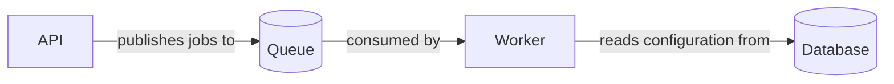

Caption: The API publishes jobs to a queue; a worker consumes them and reads configuration from a database. There is no direct API-to-database connection.

```mermaid
flowchart LR
  API[API] -->|publishes jobs to| Q[(Queue)]
  Q -->|consumed by| W[Worker]
  W -->|reads configuration from| DB[(Database)]
```
