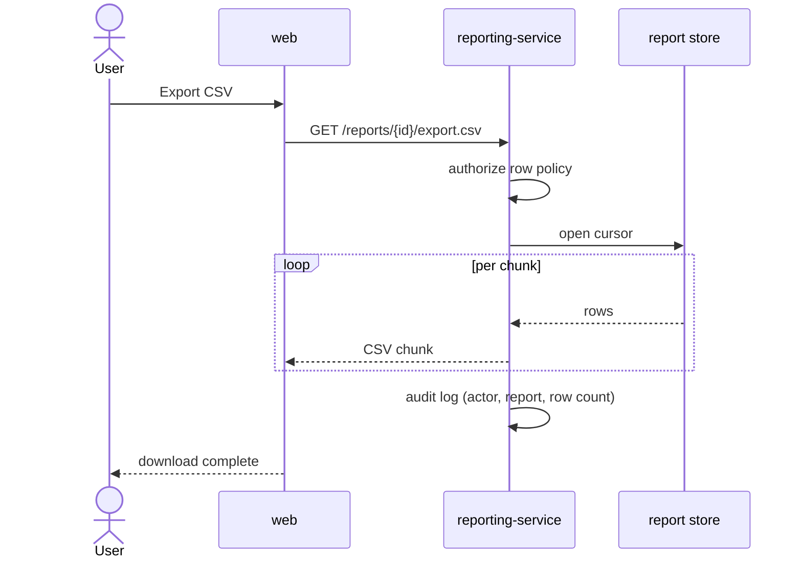

# Decision — stream the export instead of generating a file

- **owner:** `principal-swe-architect`
- **status:** decided, 2026-03-02
- **applies to:** `csv-export-api`

## Context

An export must return the full row set of a saved report. Reports range from a
few hundred rows to roughly a million.

## Options considered

**A. Stream the CSV directly from the query cursor.** (chosen)
Constant memory, no new storage surface, no lifecycle to manage. The cost is
that the request occupies a connection for the duration, and a mid-stream
failure cannot be resumed.

**B. Generate a file to object storage, return a signed URL.**
Resumable and decoupled from the request. But it introduces a storage bucket, a
signed-URL surface, a retention policy, and a cleanup job — four durable
liabilities — for a feature whose p95 export is small.

**C. Paginate and let the client assemble.**
Rejected: it pushes correctness (ordering, gap handling) onto every client and
produces a worse artifact for the user.

## Decision

Option A. The p95 export fits comfortably inside the gateway timeout, and the
operational surface of Option B is not justified by the current distribution.

## Revisit when

A single report crosses roughly 5M rows, or exports begin failing on timeout
often enough to appear in support volume. At that point Option B becomes the
cheaper trade and this decision should be reopened rather than patched around.

## Diagram

